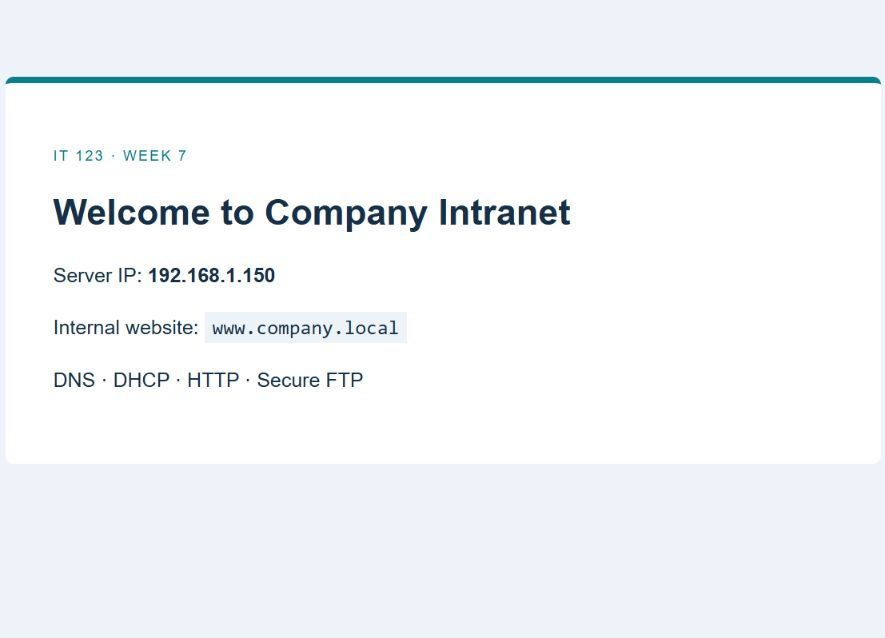

# IT 123 — Week 7: Configuring and Securing Network Services

**Lab Performance 2 — Ubuntu Server**

**Completed and verified on September 27, 2026.** DNS, Apache, DHCP and FTPS are active and enabled. The client obtained **192.168.1.160**, encrypted transfers passed using **TLS 1.3**, and access from outside the lab LAN was blocked. See [lab notes and results](lab_notes.md).

This lab uses the existing VirtualBox VM `ubuntu_server`. The lab LAN is an isolated Linux bridge inside Ubuntu, with static server address **192.168.1.150/24**. Its existing VirtualBox NAT interface supplies internet access for package downloads. No DHCP traffic is sent to the host's physical network.

## Topology

| Component | Address / role |
|---|---|
| Ubuntu `enp0s3` | VirtualBox NAT, DHCP address 10.0.2.15 |
| Ubuntu `br-lab` | Static 192.168.1.150/24; DNS, DHCP, HTTP and FTPS |
| Temporary test client | Linux network namespace attached to `br-lab`; obtains a real DHCP lease |
| Windows browser | http://127.0.0.1:8087 → VirtualBox NAT forward → Apache port 80 |
| Outside-LAN test client | Separate namespace, 198.18.0.2/30; used to test FTP blocking |

The namespace clients are separate network stacks within this VM, **not additional virtual machines or physical office computers**. They are removed after testing. To serve other VMs or office machines, attach a suitable isolated VM adapter and adjust the lab interface binding. The lab does not advertise a nonexistent 192.168.1.1 router.

## Files

- `scripts/setup.sh`: executed installation and configuration procedure.
- `scripts/verify.sh`: DHCP, DNS, HTTP, FTPS and access restriction tests.
- `configs/`: copies of the actual non-secret service configuration files.
- `evidence/`: actual command output, including installation and tests.
- `screenshots/`: actual VM console and website captures.



## Demonstration commands

Run in Ubuntu:

```bash
ip -4 address show br-lab
nslookup www.company.local 127.0.0.1
dig +tcp @127.0.0.1 www.company.local
nslookup www.example.local 127.0.0.1
curl http://192.168.1.150/
systemctl is-active named apache2 isc-dhcp-server vsftpd
sudo ufw status numbered
```

Open **http://127.0.0.1:8087** in the Windows host browser while the VM is running. It shows “Welcome to Company Intranet” and “Server IP: 192.168.1.150”. Direct host access to 192.168.1.150 is not configured because the lab bridge is internal to Ubuntu.

## Security and differences from the worksheet

- DNS accepts the lab subnet and localhost, supports both UDP and TCP 53, disables recursive queries, and disallows zone transfers.
- DHCP serves only `br-lab`, with the required range **192.168.1.160–192.168.1.170**. It supplies **192.168.1.150** as DNS so clients can resolve `company.local`. Public DNS servers do not know this private zone.
- FTP binds to 192.168.1.150, disables anonymous access, permits only the listed local account `kadmin`, and confines it to `/srv/ftp/kadmin`. Uploads go in `uploads/`.
- FTP requires explicit TLS for login and data. Use an FTPS-capable client with the existing `kadmin` password. The worksheet's plain `ftp` login is intentionally rejected. A self-signed lab certificate is used; its private key and all passwords are excluded from this repository.
- UFW allows LAN FTP control port 21 and passive ports 40000–40010, then denies those ports from other sources. Binding an address alone is not treated as a source-address restriction.
- HTTP is left unencrypted to match the Apache task. Host forwarding binds only to 127.0.0.1.
- `.local` is used because the assignment requires it; explicit DNS queries avoid ambiguity with multicast DNS clients.

ISC DHCP is used to match the worksheet. It is legacy software; Ubuntu's documentation recommends Kea for new deployments. See [Ubuntu DHCP instructions](https://ubuntu.com/server/docs/how-to/networking/install-isc-dhcp-server/) and [Kea instructions](https://ubuntu.com/server/docs/how-to/networking/install-isc-kea/).

## Recovery

VirtualBox snapshot: **Week7-before-services**. Original guest configurations are backed up under `/root/week7-before-services`. Restoring the snapshot would roll back all VM changes after the snapshot, so use it only if that rollback is intended.

Temporary SSH access is used solely for this lab and removed after evidence collection. The localhost HTTP forwarding rule remains for demonstration.
