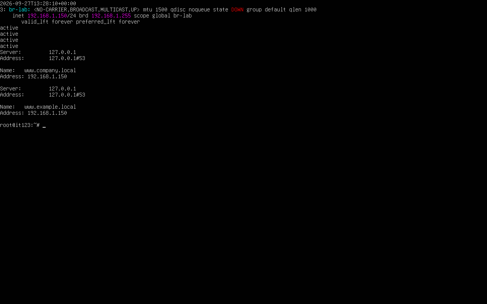
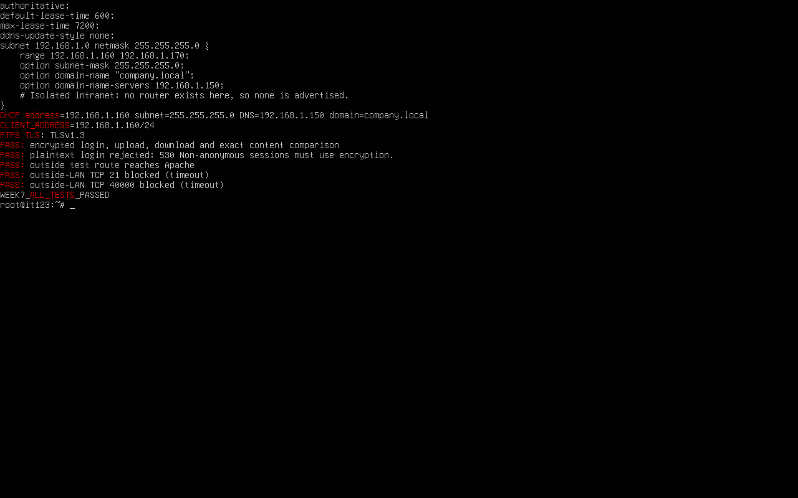
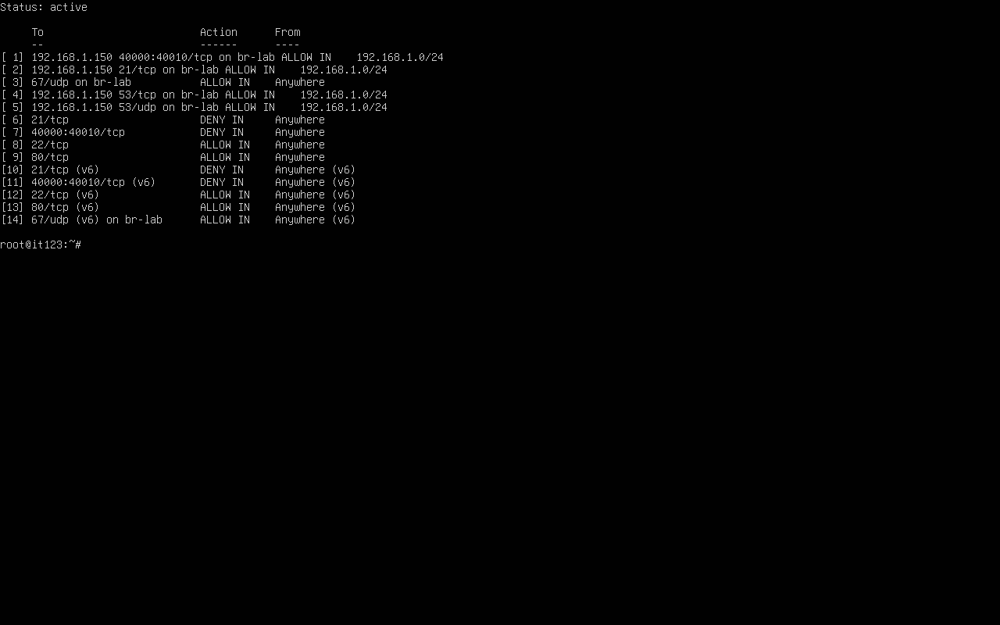

# Week 7 laboratory procedure and results

**Course:** IT 123

**Assessment:** Lab Performance 2 — Configuring and Securing Network Services

**Date performed:** September 27, 2026

**Environment:** Existing `ubuntu_server` VirtualBox VM, Ubuntu 26.04.1 LTS

## 1. Prepare the server and isolated network

A VirtualBox snapshot, `Week7-before-services`, was saved before changes. The VM's existing NAT connection remained available for package downloads. A separate software bridge, `br-lab`, was configured with static address **192.168.1.150/24** through [Netplan](configs/etc/netplan/70-week7-lab.yaml). No physical interface was attached to this bridge. This keeps the lab DHCP server isolated from the real home network.

```bash
sudo apt-get update
sudo apt-get install -y bind9 bind9utils dnsutils apache2 vsftpd isc-dhcp-server udhcpc ufw openssl
sudo netplan generate
sudo netplan apply
ip -4 address show br-lab
```

The bridge has `NO-CARRIER` after test clients are removed; the static address remains configured. This is expected for an empty software bridge. During client testing, a virtual Ethernet pair connects the client namespace to the bridge. These are real service tests within one VM, not tests between two physical computers or two VMs.

## 2. Configure and test DNS

Two master zones were added to [named.conf.local](configs/etc/bind/named.conf.local): `example.local` from the guide and `company.local` from the student exercise. Each contains `ns1`, `www`, and zone-apex A records pointing to **192.168.1.150**. The SOA serial is `2026092701`.

```bash
sudo named-checkconf
sudo named-checkzone company.local /etc/bind/db.company.local
sudo named-checkzone example.local /etc/bind/db.example.local
sudo systemctl restart named
nslookup www.company.local 127.0.0.1
nslookup www.example.local 127.0.0.1
```

Both names resolved successfully. A DHCP client also queried `192.168.1.150` over UDP and TCP; both returned the required address. Recursion is disabled, queries are limited to localhost and the lab subnet, and zone transfers are disabled. See [BIND options](configs/etc/bind/named.conf.options), [company zone](configs/etc/bind/db.company.local), and [example zone](configs/etc/bind/db.example.local).



## 3. Configure and test DHCP

[dhcpd.conf](configs/etc/dhcp/dhcpd.conf) defines **192.168.1.160–192.168.1.170**, mask **255.255.255.0**, DNS **192.168.1.150**, and domain **company.local**. [The interface setting](configs/etc/default/isc-dhcp-server) binds DHCP only to `br-lab`. The isolated network has no router, so it does not advertise the worksheet's nonexistent gateway `192.168.1.1`. The internal DNS server replaces the worksheet's public DNS addresses so the company zone can resolve.

```bash
sudo dhcpd -t -cf /etc/dhcp/dhcpd.conf
sudo systemctl restart isc-dhcp-server
```

The verification script created a temporary Linux network namespace with its own Ethernet interface and ran `udhcpc`. The real DISCOVER/OFFER/REQUEST/ACK exchange resulted in **192.168.1.160/24**, with the correct DNS server and domain. The server lease database and journal confirm the lease. The temporary client was removed after testing.

## 4. Configure and test Apache

The default `/var/www/html/index.html` was replaced with [the company intranet page](configs/var/www/html/index.html). It displays:

> Welcome to Company Intranet
>
> Server IP: 192.168.1.150

```bash
sudo apache2ctl configtest
sudo systemctl restart apache2
curl http://192.168.1.150/
```

The client test supplied the company hostname through `curl --resolve`, after separately verifying DNS. The Windows host also received **HTTP 200 OK** through the localhost-only VirtualBox forward **127.0.0.1:8087 → guest port 80**. The actual page was opened in a host browser and captured. This forwarding rule remains for demonstration; it does not expose the website on the host's external interfaces.


## 5. Enable FTP with LAN restrictions and encryption

[vsftpd.conf](configs/etc/vsftpd.conf) enables local uploads, disables anonymous login, binds to **192.168.1.150**, uses passive ports **40000–40010**, and requires TLS for login and data transfer. A self-signed lab certificate was generated. Its [public certificate](configs/etc/ssl/certs/week7-ftps.crt) is included for verification; its private key is not included.

Only the existing `kadmin` account remains in the FTP allowlist. Its FTP root is `/srv/ftp/kadmin`, owned by root, with an `uploads` directory owned by `kadmin`. This supports writable uploads without making the chroot root writable. The existing account password was not changed.

The verification script used a disposable account with a random, unrecorded password. From the LAN client it performed certificate-verified **TLS 1.3** login, uploaded a file, downloaded it, and checked exact contents. Plaintext login was rejected with `530 Non-anonymous sessions must use encryption.` The test account and its directory were then removed. The `kadmin` password login was not separately tested because its password was not provided to the automation.

Use explicit FTPS rather than the worksheet's unencrypted `ftp` login. The self-signed certificate is suitable for this lab; trust the included certificate in the client after checking its fingerprint in the final-state output.



## 6. Apply and verify the firewall

UFW is enabled with incoming traffic denied by default and outgoing traffic allowed. SSH and HTTP are allowed. Lab DNS is allowed over **UDP and TCP 53**; DHCP is allowed on **UDP 67** only on the lab bridge. LAN FTP allows precede general denials for ports **21** and **40000–40010**.

```bash
sudo ufw status numbered
systemctl is-active named apache2 isc-dhcp-server vsftpd
systemctl is-enabled named apache2 isc-dhcp-server vsftpd
```

A separate outside-LAN namespace at **198.18.0.2** could reach Apache as a routing control test, but TCP **21** and **40000** timed out as expected. Together with the exact source/interface firewall rules, this verifies the tested FTP restriction. The test did not probe every passive port individually. FTP binding by itself would not restrict source addresses; the firewall supplies that restriction.



## Results

| Check | Observed result |
|---|---|
| BIND configuration and both zones | Valid |
| `www.company.local` | 192.168.1.150, UDP and TCP |
| `www.example.local` | 192.168.1.150 |
| DHCP client | 192.168.1.160/24, correct DNS/domain |
| Apache configuration | Syntax OK |
| Intranet page from lab client and host | Successful; host HTTP 200 |
| FTPS upload/download | Exact content match, TLS 1.3 |
| Plain FTP login | Rejected |
| Outside-LAN FTP control and sample passive port | Blocked |
| Four service units | Active and enabled |
| Firewall | Active |

The complete unedited [setup output](evidence/01-setup.txt), [test output](evidence/02-verification.txt), [final state](evidence/03-final-state.txt), and [host HTTP response](evidence/04-host-http.txt) are included. The successful verification run ends with `WEEK7_ALL_TESTS_PASSED`.

[Access cleanup evidence](evidence/05-access-cleanup.txt) records removal of the temporary SSH key, a new connection rejected with `Permission denied`, and the remaining HTTP-only forwarding rule. The host's temporary private/public key files were deleted, and the administrator console was exited back to `kadmin`.

The services were checked running and enabled for startup; no post-install reboot test was performed. Internet routing for DHCP clients and service access from another VM were not part of this isolated demonstration.

## References

- [Ubuntu: ISC DHCP server](https://ubuntu.com/server/docs/how-to/networking/install-isc-dhcp-server/) — legacy package used to match the guide; Kea is recommended for new deployments.
- [BIND configuration reference](https://bind9.readthedocs.io/en/v9.18.36/reference.html) — listener, query and transfer access controls.
- [Netplan manual](https://manpages.ubuntu.com/manpages/jammy/man5/netplan.5.html) — a bridge can have an empty member-interface list.

No passwords, SSH private keys, FTPS private keys, or VM disk images are part of the submission.
